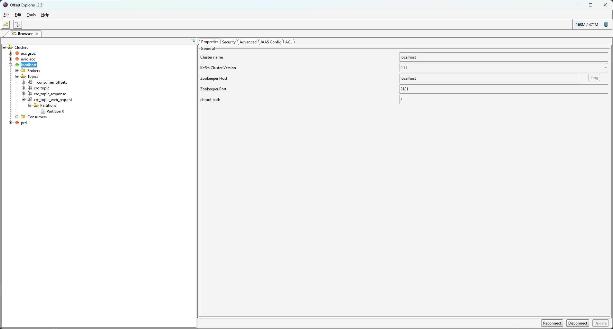
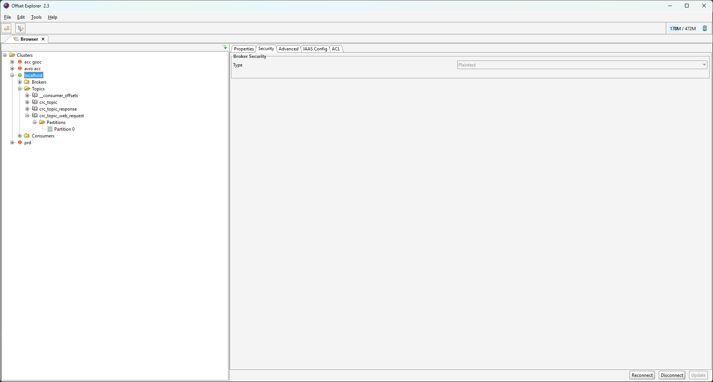
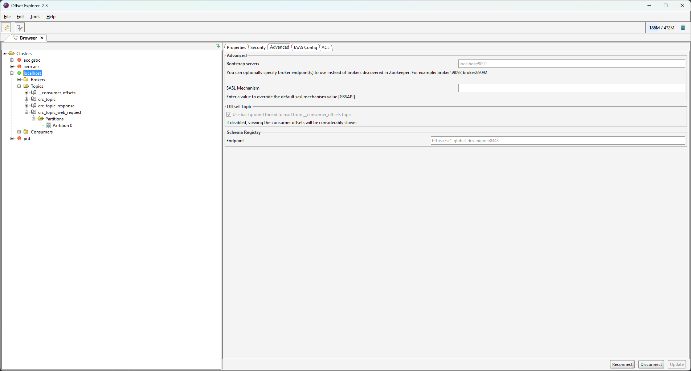

== Service description
** mock for request coming from UI
** each microservice is storing events in state store
** user is sending event with incorrect values to service-a
** service-a is correcting the values using service-b
** service-c should send the event to service-c which saves domain object with correct values

== How to build all microservices?
* gradlew clean build in root project dir

== How to run elasticsearch?
* go to docker-compose/elasticsearch and run docker-compose up -d

== How to run kafka?
* go to docker-compose/kafka and run docker-compose up -d

== How to check if containers are running?
* docker ps

== How to build image for microservice?
go to microservice dir (/microservices/service-a) and run

* docker build . -t service-a

== How to run container with microservice image?

*  docker run -e spring.profiles.active=local,kafka_binding --network host --user 1001 service-a

== How to access Kibana? (UI for elasticsearch)

* start elasticsearch container and go to http://localhost:5601

== How to access Kafka?

* you can use offset explorer with given configuration:

== TODO

* To obtain certificate after this course you need to implement service-c
* Service-c should be able to receive messages to from service-a
* "Service-a to service-c" message should contain DomainObject
* Service-a should not invoke domainObjectRepository.save(domainObject) method
** Consumer "MicroserviceBResponseConsumer" should be changed to processor (use java.util.functions.Function)
** Service-a should send DomainObject to service-c
* Service-c should be only one service responsible for saving DomainObject